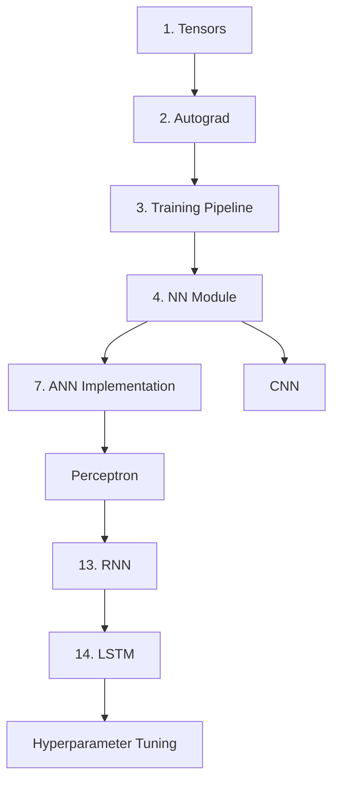

# 🔥 PyTorch Framework - Deep Learning Journey

[](https://colab.research.google.com/)
[](https://pytorch.org/)
[](https://python.org/)

> A comprehensive collection of PyTorch implementations covering fundamental to advanced deep learning concepts

## 🎯 Overview

This repository contains a complete learning path for PyTorch framework, featuring hands-on implementations of various neural network architectures and deep learning concepts. Perfect for beginners starting their deep learning journey and practitioners looking to strengthen their PyTorch skills.

## 📚 Contents

### 🔰 Fundamentals
- **[Tensors in PyTorch](1_tensor_in_pytorch.ipynb)** - Master PyTorch tensors, GPU operations, and basic tensor manipulations
- **[Autograd](2_Autograd.ipynb)** - Understanding automatic differentiation and gradient computation
- **[Training Pipeline](3_Training_pipeline.ipynb)** - Complete workflow from data loading to model evaluation

### 🧠 Neural Networks
- **[NN Module](4_NN_Module.ipynb)** - Building neural networks using PyTorch's nn.Module
- **[ANN Implementation](7_ANN_using_PyTorch.ipynb)** - Artificial Neural Networks with practical examples
- **[Perceptron](perceptron.ipynb)** - Single layer perceptron implementation and visualization

### 🔄 Sequence Models
- **[RNN](13_RNN_using_pytorch.ipynb)** - Recurrent Neural Networks for sequence processing
- **[LSTM](14_LSTM_using_Pytorch.ipynb)** - Long Short-Term Memory networks for advanced sequence modeling

### 🎛️ Advanced Topics
- **[Hyperparameter Tuning](HyperparameterTuning.ipynb)** - Optimize model performance with systematic tuning
- **[CNN Implementation](CNN.ipynb)** - Convolutional Neural Networks (includes TensorFlow comparison)

## 🚀 Quick Start

### Prerequisites
```bash
pip install torch torchvision torchaudio
pip install numpy pandas matplotlib seaborn scikit-learn
pip install jupyter notebook
```

### Getting Started
1. Clone the repository:
```bash
git clone https://github.com/ganeshagrahari/Pytorch-Framework.git
cd Pytorch-Framework
```

2. Launch Jupyter Notebook:
```bash
jupyter notebook
```

3. Start with [Tensors in PyTorch](1_tensor_in_pytorch.ipynb) for fundamentals

## 📋 Learning Path



## 🎯 Key Features

- ✅ **Beginner Friendly**: Step-by-step progression from basics to advanced topics
- ✅ **Hands-on Examples**: Real datasets and practical implementations
- ✅ **Google Colab Ready**: All notebooks can run directly in Colab
- ✅ **Comprehensive Coverage**: From tensors to complex architectures
- ✅ **Best Practices**: Following PyTorch conventions and modern practices

## 🛠️ Technologies Used

- **PyTorch** - Primary deep learning framework
- **NumPy** - Numerical computations
- **Pandas** - Data manipulation
- **Matplotlib/Seaborn** - Data visualization
- **Scikit-learn** - Data preprocessing and metrics
- **NLTK** - Natural language processing (for RNN/LSTM examples)

## 📊 Datasets Used

- Breast Cancer Detection Dataset
- Fashion MNIST (reduced)
- Placement Dataset
- Custom Q&A Dataset for NLP
- Customer Churn Dataset

## 🎓 Learning Outcomes

After completing this repository, you'll be able to:

- 🔸 Master PyTorch tensors and GPU acceleration
- 🔸 Understand automatic differentiation and backpropagation
- 🔸 Build and train various neural network architectures
- 🔸 Implement CNNs for computer vision tasks
- 🔸 Create RNNs and LSTMs for sequence modeling
- 🔸 Optimize models through hyperparameter tuning
- 🔸 Follow PyTorch best practices and conventions

## 🤝 Contributing

Contributions are welcome! Please feel free to submit a Pull Request. For major changes:

1. Fork the repository
2. Create your feature branch (`git checkout -b feature/AmazingFeature`)
3. Commit your changes (`git commit -m 'Add some AmazingFeature'`)
4. Push to the branch (`git push origin feature/AmazingFeature`)
5. Open a Pull Request

## 📝 License

This project is open source and available under the [MIT License](LICENSE).

## 🙏 Acknowledgments

- PyTorch team for the amazing framework
- Various dataset contributors
- Open source community for inspiration

## 📞 Connect

- GitHub: [@ganeshagrahari](https://github.com/ganeshagrahari)
- Feel free to ⭐ this repository if you found it helpful!

---

<div align="center">
  <i>Happy Learning! 🚀</i>
</div>
